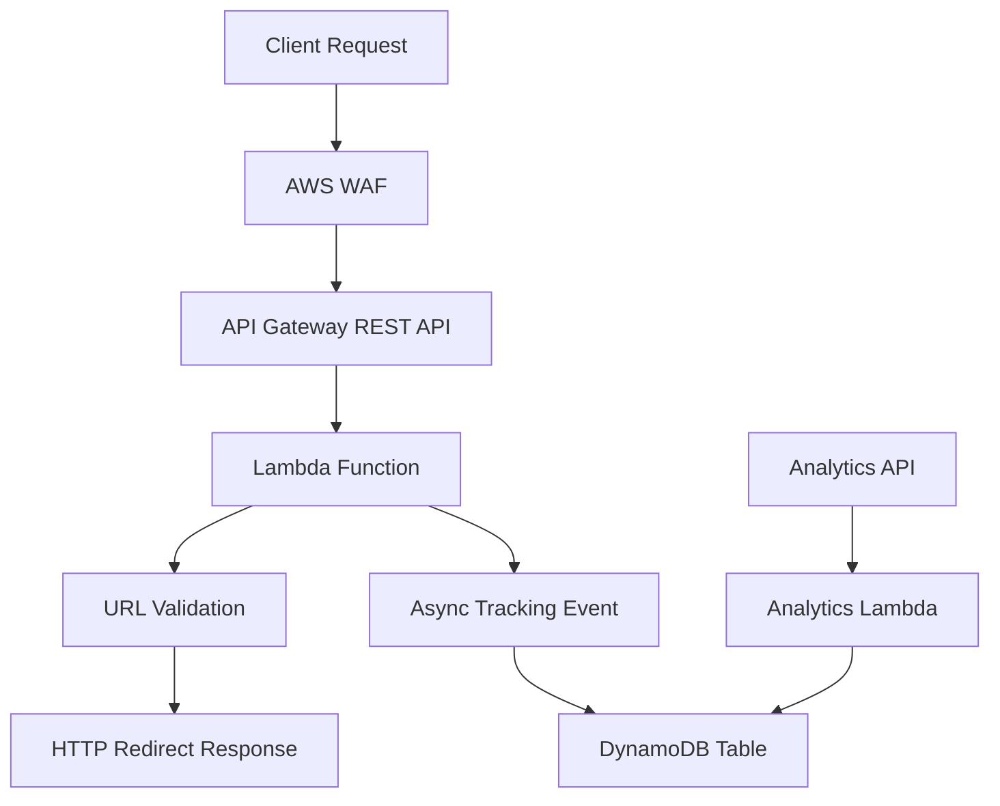

# Design Document

## Overview

This document outlines the design for a serverless URL redirection and tracking application deployed on AWS China. The system provides fast URL redirection while asynchronously capturing tracking data for analytics. The architecture leverages AWS serverless services to ensure scalability, minimal operational overhead, and cost-effectiveness.

## Architecture

The application follows a serverless microservices architecture with the following key components:



### Key Design Decisions

1. **Synchronous Redirection**: The primary Lambda function handles URL validation and redirection synchronously to minimize latency
2. **Asynchronous Tracking**: Tracking data is recorded asynchronously using Lambda's built-in event handling to avoid impacting redirect performance
3. **DynamoDB for Storage**: Chosen for its serverless nature, automatic scaling, and permanent data retention capabilities
4. **AWS WAF for Security**: Implements rate limiting and basic security protections at the edge

## Components and Interfaces

### 1. API Gateway REST API

**Purpose**: Entry point for all redirection requests

**Configuration**:
- Endpoint: `/{proxy+}` to capture all paths
- Method: GET
- Integration: Lambda Proxy Integration
- Region: AWS China (Beijing - cn-north-1)

**Request Format**:
```
GET https://edgeup.aws.a2z.org.cn/url?sa=EdgeUp001&url=https://aws.amazon.com/cn/blogs/china/new-aws-waf-antiddos-managed-rules/
```

**Response Format**:
```http
HTTP/1.1 302 Found
Location: https://aws.amazon.com/cn/blogs/china/new-aws-waf-antiddos-managed-rules/
```

### 2. Redirection Lambda Function

**Purpose**: Core business logic for URL validation, redirection, and tracking initiation

**Runtime**: Node.js 22.x
**Memory**: 128 MB (sufficient for URL processing)
**Timeout**: 5 seconds

**Input Interface**:
```json
{
  "queryStringParameters": {
    "url": "https://aws.amazon.com/cn/blogs/china/new-aws-waf-antiddos-managed-rules/",
    "sa": "EdgeUp001"   # the `sa` querystring MUST start with `EdgeUp` and followed by 3 digits
  },
  "requestContext": {
    "identity": {
      "sourceIp": "192.168.1.1"
    }
  },
  "headers": {
    "X-Forwarded-For": "192.168.1.1"
  }
}
```

**Output Interface**:
```json
{
  "statusCode": 302,
  "headers": {
    "Location": "https://aws.amazon.com/cn/blogs/china/new-aws-waf-antiddos-managed-rules/"
  }
}
```

### 3. DynamoDB Table

**Purpose**: Persistent storage for tracking data

**Table Design**:
- Table Name: `url-redirection-tracking`
- Partition Key: `tracking_id` (String) - UUID for each tracking event
- Sort Key: `timestamp` (String) - ISO 8601 timestamp for time-based queries

**Item Structure**:
```json
{
  "tracking_id": "uuid-v4-string",
  "timestamp": "2024-01-15T10:30:45.123Z",
  "formatted_timestamp": "2024-01-15 10:30:45",
  "source_attribution": "EdgeUp",
  "client_ip": "192.168.1.1",
  "destination_url": "https://aws.amazon.com/cn/blogs/china/new-aws-waf-antiddos-managed-rules/",
  "ttl": 1735689045
}
```

**Indexes**:
- GSI1: `source_attribution` (PK) + `timestamp` (SK) for source-based queries
- GSI2: `formatted_timestamp` (PK) for time-based analytics

### 4. Analytics Lambda Function

**Purpose**: Process and aggregate tracking data for reporting

**Runtime**: Python 3.13
**Memory**: 256 MB
**Timeout**: 30 seconds

**Functionality**:
- Query DynamoDB for tracking data
- Aggregate statistics by source, time period, and destination
- Support filtering and sorting operations

### 5. AWS WAF Web ACL

**Purpose**: Security and rate limiting

**Rules**:
- Rate limiting: 10 requests per 5-minute window per IP
- Geographic restrictions: Allow only specific regions if needed
- SQL injection protection
- XSS protection
- Bad Input protection

## Data Models

### TrackingEvent

```typescript
interface TrackingEvent {
  tracking_id: string;           // UUID v4
  timestamp: string;             // ISO 8601 format
  formatted_timestamp: string;   // "yyyy-MM-dd HH:mm:ss" format
  source_attribution?: string;   // SA parameter
  client_ip: string;            // Client IP address
  destination_url: string;      // Validated destination URL
  ttl?: number;                 // Optional TTL for data retention
}
```

### RedirectionRequest

```typescript
interface RedirectionRequest {
  url: string;                  // Required destination URL
  sa?: string;                  // Required source attribution
}
```

### AnalyticsQuery

```typescript
interface AnalyticsQuery {
  start_date?: string;          // Filter start date
  end_date?: string;            // Filter end date
  source_attribution?: string;  // Filter by source
  limit?: number;               // Result limit
  sort_order?: 'asc' | 'desc'; // Sort order
}
```

## Error Handling

### URL Validation Errors

**Invalid URL Format**:
- Status Code: 400
- Response: `{"error": "Bad request"}`

**Unauthorized Domain**:
- Status Code: 400
- Response: `{"error": "Bad request"}`

**Missing URL Parameter**:
- Status Code: 400
- Response: `{"error": "Bad request"}`

### Rate Limiting

**Rate Limit Exceeded**:
- Status Code: 403
- Response: `{"error": "Forbidden"}`

### System Errors

**Lambda Function Errors**:
- Status Code: 500
- Response: `{"error": "Internal server error"}`
- Logging: CloudWatch Logs with detailed error information

**DynamoDB Errors**:
- Retry logic with exponential backoff
- Dead letter queue for failed tracking events
- CloudWatch alarms for monitoring

## Testing Strategy

### Unit Testing

**Lambda Functions**:
- URL validation logic
- Tracking data formatting
- Error handling scenarios
- Analytics aggregation functions

**Test Framework**: Jest (Node.js) or pytest (Python)

### Integration Testing

**API Gateway + Lambda**:
- End-to-end redirection flow
- Query parameter handling
- Error response validation

**DynamoDB Integration**:
- Data persistence verification
- Query performance testing
- Index utilization validation

### Load Testing

**Performance Requirements**:
- Target: 10 requests per second
- Response time: < 200ms for redirections
- Concurrent users: Up to 50

**Tools**: Artillery.js or AWS Load Testing Solution

### Security Testing

**Input Validation**:
- Malformed URL handling

## Deployment Considerations

### AWS China Region Specifics

- **Region**: ap-northeast-1 (Tokyo)
- **Services**: All services available in AWS except for CloudFront
- **Local Profile** primary
- **Networking**: No CloudFront usage as specified in requirements

### Infrastructure as Code

**AWS CDK or CloudFormation**:
- API Gateway configuration
- Lambda function deployment
- DynamoDB table creation
- WAF rules setup
- IAM roles and policies

### Monitoring and Observability

**CloudWatch Metrics**:
- Lambda invocation count and duration
- API Gateway request count and latency
- DynamoDB read/write capacity utilization
- WAF blocked requests

**CloudWatch Alarms**:
- High error rates
- Increased response times
- DynamoDB throttling
- Lambda function failures

**Logging Strategy**:
- Structured logging in JSON format
- Request/response correlation IDs
- Performance metrics logging
- Error details with stack traces