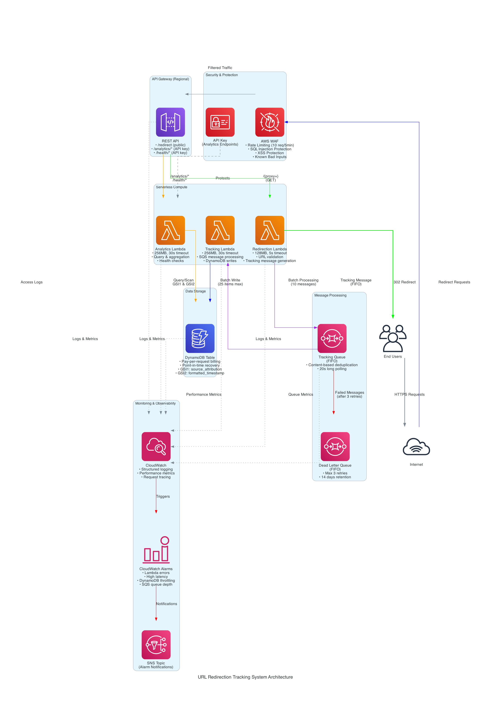
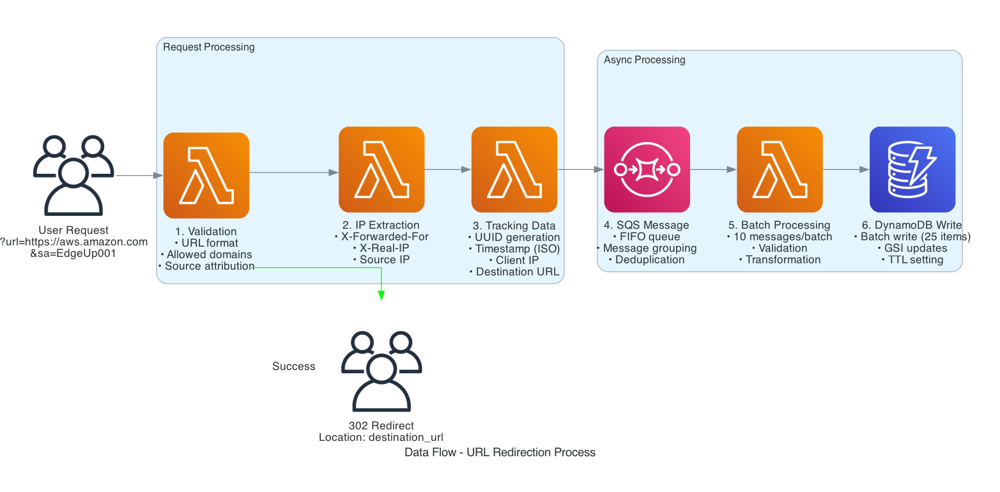
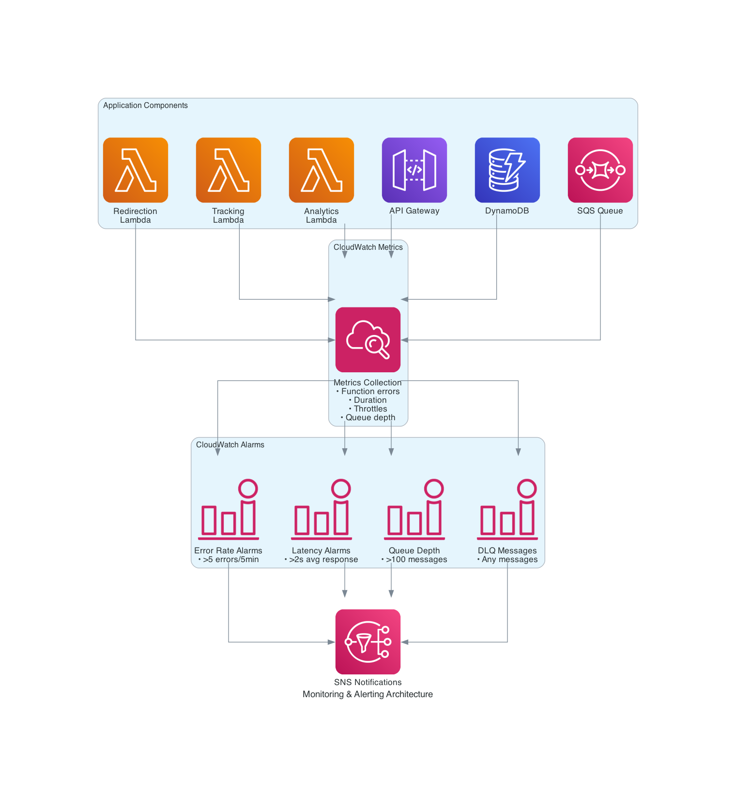

# URL Redirection Tracking System

A comprehensive serverless URL redirection and analytics platform built on AWS, featuring a robust backend API and a modern React-based web dashboard for real-time monitoring and business intelligence.

## Overview

This system provides secure URL redirection services with comprehensive tracking capabilities and an intuitive web interface for data analysis. It's built using AWS serverless technologies and follows best practices for scalability, security, and observability.

### Complete System Components

#### **Backend Infrastructure** (Serverless API)
- **Secure URL Redirection**: Only allows redirections to authorized domains (amazonaws.cn, amazonaws.com, amazon.com)
- **Real-time Tracking**: Captures detailed analytics data including IP addresses, timestamps, and source attribution
- **Scalable Architecture**: Serverless design that automatically scales based on demand
- **Comprehensive Monitoring**: Built-in CloudWatch alarms and health checks
- **Security**: WAF protection with rate limiting and common attack prevention
- **Analytics API**: RESTful API for querying and aggregating tracking data

#### **Frontend Dashboard** (React Web Application)
📋 **[Complete Frontend Documentation →](frontend/README.md)**

- **Interactive Analytics Dashboard**: Real-time KPIs, charts, and data visualizations
- **Advanced Data Analysis**: Filtering, sorting, and export capabilities for business intelligence
- **System Health Monitoring**: Component-specific monitoring and diagnostics
- **Mobile-Responsive Design**: Accessible on desktop, tablet, and mobile devices
- **WCAG 2.1 AA Compliance**: Fully accessible interface with screen reader support

### Key Features

- **🔗 URL Redirection**: Secure, validated redirections with comprehensive logging
- **📊 Real-time Analytics**: Interactive dashboards with KPIs, trends, and insights
- **🛡️ Enterprise Security**: WAF protection, rate limiting, and domain validation
- **📱 Multi-Device Access**: Responsive web interface for all screen sizes
- **⚡ High Performance**: Global CDN delivery with sub-second response times
- **🔍 Advanced Filtering**: Query data by date ranges, sources, and destinations
- **📈 Data Export**: CSV/JSON export for reporting and further analysis
- **🏥 Health Monitoring**: Real-time system status and performance metrics

## Architecture

The URL Redirection Tracking System is built using a serverless architecture on AWS, designed for high availability, scalability, and cost-effectiveness. The system processes URL redirection requests while capturing comprehensive analytics data for business intelligence.



### System Overview

The architecture consists of three main Lambda functions working together:

1. **Redirection Lambda**: Handles incoming URL redirection requests with real-time validation
2. **Tracking Lambda**: Processes tracking data asynchronously via SQS for reliable data persistence
3. **Analytics Lambda**: Provides RESTful API endpoints for querying and aggregating tracking data

### Core Infrastructure Components

- **API Gateway (Regional)**: Entry point for all HTTP requests with built-in throttling
- **AWS WAF**: Web application firewall providing security protection and rate limiting
- **AWS Lambda**: Serverless compute functions for business logic processing
- **DynamoDB**: NoSQL database with Global Secondary Indexes for efficient querying
- **SQS FIFO Queue**: Message queue ensuring ordered, exactly-once processing
- **CloudWatch**: Comprehensive monitoring, logging, and alerting system

### Data Flow Architecture



The request processing follows this flow:

1. **User Request**: Client sends GET request with URL and optional source attribution
2. **Security Layer**: AWS WAF filters malicious traffic and enforces rate limits
3. **API Gateway**: Routes requests to appropriate Lambda functions
4. **Validation**: Redirection Lambda validates URL format and allowed domains
5. **Tracking Generation**: Creates tracking data with UUID, timestamp, and client information
6. **Async Processing**: Sends tracking message to SQS FIFO queue for reliable processing
7. **Data Persistence**: Tracking Lambda batch processes messages and stores in DynamoDB
8. **User Response**: Returns 302 redirect response to client

### Monitoring & Observability



The system includes comprehensive monitoring with:

- **13+ CloudWatch Alarms** monitoring errors, latency, and system health
- **Structured JSON Logging** with correlation IDs for request tracing
- **Performance Metrics** for all components (Lambda, API Gateway, DynamoDB, SQS)
- **SNS Notifications** for critical alerts
- **Health Check Endpoints** for system status monitoring

### Key Architectural Features

#### Security
- **Domain Validation**: Only allows redirections to authorized domains (amazonaws.cn, amazonaws.com, amazon.com)
- **Rate Limiting**: 10 requests per 5-minute window per IP address
- **API Key Protection**: Analytics endpoints require authentication
- **WAF Protection**: SQL injection, XSS, and known bad inputs filtering

#### Reliability
- **FIFO Queue Processing**: Ensures ordered message processing with deduplication
- **Dead Letter Queue**: Handles failed messages with retry logic (max 3 attempts)
- **Point-in-Time Recovery**: DynamoDB backup for data protection
- **Batch Processing**: Efficient handling of up to 25 DynamoDB writes per batch

#### Performance
- **Global Secondary Indexes**: Optimized queries by source attribution and timestamp
- **Pay-per-Request Billing**: DynamoDB scales automatically with demand
- **Connection Pooling**: Efficient database connections in Lambda functions
- **Long Polling**: SQS reduces empty receives and improves cost efficiency

#### Scalability
- **Serverless Architecture**: Automatically scales based on demand
- **Regional Deployment**: Currently deployed in ap-northeast-1 (Tokyo)
- **Concurrent Execution Limits**: Controlled DynamoDB write capacity usage
- **Message Grouping**: FIFO queue groups by client IP for parallel processing

## Getting Started

### Prerequisites

- Node.js 18+ and npm
- AWS CLI configured with appropriate credentials
- AWS CDK CLI (`npm install -g aws-cdk@latest`) - **Note**: Ensure you have CDK CLI version 2.1020.2 or later for compatibility
- TypeScript (`npm install -g typescript`)

### Installation

1. Clone the repository:
```bash
git clone <repository-url>
cd url-redirection-tracking
```

2. Install dependencies:
```bash
npm install
```

3. Build the project:
```bash
npm run build
```

4. Run tests:
```bash
npm test
```

### Deployment

This system consists of two main components that need to be deployed:

#### **Backend Infrastructure Deployment** (Required First)

Deploy the serverless backend infrastructure:

**Quick Deployment:**
```bash
# Deploy backend to development environment
./scripts/deploy.sh
```

**Custom Deployment:**
```bash
# Deploy to production environment
./scripts/deploy.sh -e prod -p production

# Deploy with custom region
./scripts/deploy.sh -r us-west-2

# Dry run (synthesize only)
./scripts/deploy.sh --dry-run

# Skip tests during deployment
./scripts/deploy.sh --skip-tests
```

#### **Frontend Dashboard Deployment** (Optional)

Deploy the React-based web dashboard for analytics and monitoring:

📋 **[Complete Frontend Deployment Guide →](frontend/README.md#-deployment-guide)**

**Quick Frontend Deployment:**
```bash
# 1. Setup environment (CRITICAL - must be done first)
./scripts/setup-frontend-config.sh

# 2. Deploy frontend infrastructure
cdk deploy FrontendStack

# 3. Build and deploy frontend
cd frontend
npm install
npm run build:production
npm run deploy:production
```

**Note**: The backend infrastructure must be deployed first, as the frontend depends on the backend API Gateway and requires API keys for authentication.

### Accessing the Deployed System

#### **Web Dashboard** (Frontend)
After deploying the frontend, access the analytics dashboard via the CloudFront URL:
```bash
# Get the frontend URL
aws cloudformation describe-stacks \
  --stack-name FrontendStack \
  --query 'Stacks[0].Outputs[?OutputKey==`FrontendCloudFrontDistributionUrl`].OutputValue' \
  --output text
```

**Dashboard Features:**
- **Main Dashboard** (`/`) - Real-time KPIs and analytics overview
- **Analytics Page** (`/analytics`) - Advanced filtering and data analysis
- **Health Monitoring** (`/health`) - System status and performance metrics

#### **API Endpoints** (Backend)
Access the backend API directly for programmatic integration:
```bash
# Get API Gateway URL
./scripts/get-api-key.sh

# Example API calls
curl "https://your-api-gateway-url/prod/redirect?url=https://aws.amazon.com&sa=EdgeUp001"
curl -H "X-API-Key: your-api-key" "https://your-api-gateway-url/prod/analytics/query"
```

#### Manual CDK Deployment

```bash
# Bootstrap CDK (first time only)
cdk bootstrap

# Deploy the stack
cdk deploy
```

## API Reference

### Redirection Endpoint

**GET** `/{proxy+}`

Redirects users to the specified destination URL while capturing tracking data.

**Query Parameters:**
- `url` (required): Destination URL (must be from allowed domains)
- `sa` (optional): Source attribution in format `EdgeUp###` (e.g., `EdgeUp001`)

**Example:**
```bash
curl "https://api-gateway-url.amazonaws.com/prod/redirect?url=https://aws.amazon.com&sa=EdgeUp001"
```

**Response:**
- `302 Found` with `Location` header pointing to destination URL
- `400 Bad Request` for invalid parameters
- `500 Internal Server Error` for system errors

### Analytics Endpoints

All analytics endpoints require authentication via `X-API-Key` header. The API key is automatically generated during deployment and can be retrieved using the provided script.

#### Query Tracking Events

**GET** `/analytics/query`

Retrieve tracking events with filtering and pagination.

**Query Parameters:**
- `start_date` (optional): Filter start date (ISO 8601 format)
- `end_date` (optional): Filter end date (ISO 8601 format)
- `source_attribution` (optional): Filter by source attribution
- `destination_url` (optional): Filter by destination URL
- `limit` (optional): Number of results (default: 100, max: 1000)
- `sort_order` (optional): Sort order `asc` or `desc` (default: `desc`)
- `offset` (optional): Pagination offset (default: 0)

**Example:**
```bash
curl -H "X-API-Key: your-api-key" \
  "https://api-gateway-url.amazonaws.com/prod/analytics/query?start_date=2024-01-01T00:00:00Z&limit=50"
```

#### Aggregate Statistics

**GET** `/analytics/aggregate`

Get aggregated statistics grouped by source attribution.

**Query Parameters:**
- `start_date` (optional): Filter start date (ISO 8601 format)
- `end_date` (optional): Filter end date (ISO 8601 format)
- `source_attribution` (optional): Filter by specific source attribution

**Example:**
```bash
# Get all aggregated statistics
curl -H "X-API-Key: your-api-key" \
  "https://api-gateway-url.amazonaws.com/prod/analytics/aggregate"

# Get aggregated statistics for a specific date range
curl -H "X-API-Key: your-api-key" \
  "https://api-gateway-url.amazonaws.com/prod/analytics/aggregate?start_date=2024-01-01T00:00:00Z&end_date=2024-01-31T23:59:59Z"

# Get aggregated statistics for a specific source attribution with date filtering
curl -H "X-API-Key: your-api-key" \
  "https://api-gateway-url.amazonaws.com/prod/analytics/aggregate?source_attribution=EdgeUp001&start_date=2025-08-01T00:00:00Z&end_date=2025-08-31T23:59:59Z"
```

#### Health Checks

**GET** `/health`
Basic health check endpoint (API key required).

**GET** `/health/deep`
Comprehensive health check including database connectivity (API key required).

### API Key Management

After deployment, retrieve your API key using:

```bash
# Get API key value
./scripts/get-api-key.sh

# Get API key for specific stack
./scripts/get-api-key.sh MyCustomStackName
```

The API key is required for all `/analytics/*` and `/health*` endpoints but not for redirection endpoints.

## Configuration

### Environment-Specific Configuration

Configuration files are located in the `config/` directory:

- `config/common/common.json`: Shared configuration
- `config/dev/config.json`: Development environment
- `config/prod/config.json`: Production environment
- `config/staging/config.json`: Staging environment

### Key Configuration Options

```json
{
  "region": "ap-northeast-1",
  "allowedDomains": ["amazonaws.cn", "amazonaws.com", "amazon.com"],
  "lambda": {
    "redirectionMemory": 128,
    "trackingMemory": 256,
    "analyticsMemory": 256,
    "timeout": 30
  },
  "waf": {
    "rateLimit": 100,
    "rateLimitWindow": 300
  }
}
```

## Monitoring and Operations

### CloudWatch Alarms

The system includes comprehensive monitoring with the following alarms:

- **Lambda Function Errors**: Alerts on function errors (>5 errors in 5 minutes)
- **High Latency**: Alerts on slow response times
- **DynamoDB Throttling**: Alerts on database throttling events
- **SQS Queue Depth**: Alerts on high message queue depth
- **Dead Letter Queue**: Alerts on any messages in DLQ
- **API Gateway Errors**: Alerts on 4XX/5XX error rates

### Operational Scripts

#### Monitor Dead Letter Queue

```bash
# Check DLQ status
./scripts/monitor-dlq.sh check

# List messages in DLQ
./scripts/monitor-dlq.sh list 10

# Continuous monitoring
./scripts/monitor-dlq.sh monitor 60

# Get CloudWatch metrics
./scripts/monitor-dlq.sh metrics 24
```

#### System Monitoring

```bash
# Monitor system health
./scripts/system-monitor.sh

# Check Lambda function metrics
./scripts/system-monitor.sh lambda-metrics

# Check DynamoDB metrics
./scripts/system-monitor.sh dynamodb-metrics
```

#### Reprocess Failed Messages

```bash
# Reprocess messages from DLQ
./scripts/reprocess-messages.sh

# Reprocess specific message
./scripts/reprocess-messages.sh --message-id <message-id>
```

### Log Analysis

Logs are structured in JSON format and sent to CloudWatch Logs. Each log entry includes:

- Timestamp
- Log level (DEBUG, INFO, WARN, ERROR)
- Correlation ID for request tracing
- Performance metrics
- Contextual data

Example log query in CloudWatch Insights:
```sql
fields @timestamp, level, message, context.correlationId, data
| filter level = "ERROR"
| sort @timestamp desc
| limit 100
```

## Development

### Project Structure

```
src/
├── infrastructure/          # CDK infrastructure code
│   ├── app.ts              # CDK app entry point
│   └── stack.ts            # Main stack definition
├── lambdas/                # Lambda function code
│   ├── redirection/        # URL redirection handler
│   ├── tracking/           # Tracking data processor
│   └── analytics/          # Analytics API handler
├── types/                  # TypeScript type definitions
├── utils/                  # Shared utility functions
│   ├── validation.ts       # URL and parameter validation
│   ├── ip-extraction.ts    # IP address extraction
│   ├── timestamp.ts        # Timestamp formatting
│   └── logger.ts           # Structured logging
└── __tests__/              # Integration tests

docs/
└── architecture/           # Architecture documentation
    ├── url-redirection-architecture.png    # Main system architecture
    ├── url-redirection-dataflow.png        # Data flow diagram
    └── monitoring-architecture.png         # Monitoring setup

config/                     # Environment-specific configurations
scripts/                    # Deployment and operational scripts
```

### Running Tests

```bash
# Run all tests
npm test

# Run tests with coverage
npm run test -- --coverage

# Run specific test file
npm test -- src/lambdas/redirection/__tests__/index.test.ts

# Run tests in watch mode
npm test -- --watch

# Run tests with verbose output for debugging
npm test -- --verbose
```

**Note**: If you encounter test failures related to AWS SDK mocks, ensure that handler imports are placed after mock configurations in test files.

### Local Development

```bash
# Build TypeScript
npm run build

# Synthesize CDK template
npm run synth

# Run linting
npm run lint

# Format code
npm run format
```

## Security

### Access Control

- API Gateway endpoints are protected by AWS WAF
- Analytics endpoints (`/analytics/*`) and health endpoints (`/health*`) require API key authentication via `X-API-Key` header
- Redirection endpoints (`/{proxy+}`) are publicly accessible
- Rate limiting prevents abuse (10 requests per 5-minute window per IP)

### Data Protection

- All data is encrypted at rest in DynamoDB
- Data in transit is encrypted using TLS
- IP addresses are collected for analytics but can be anonymized if required

### Allowed Domains

The system only allows redirections to these domains:
- `amazonaws.cn`
- `amazonaws.com`
- `amazon.com`

### WAF Protection

- SQL injection protection
- XSS protection
- Known bad inputs protection
- Rate limiting by IP address

## Troubleshooting

### Common Issues

#### Frontend Build Issues

If you encounter linting or test failures during frontend build, here are the solutions:

**Linting Issues:**
- Most linting warnings about `any` types are acceptable for chart libraries and can be ignored
- Critical errors (like syntax errors) should be fixed before deployment
- You can run `npm run lint -- --fix` in the frontend directory to auto-fix many issues

**Test Failures:**
- Some tests may fail due to environment differences or missing dependencies
- For production deployment, you can temporarily skip tests: `./scripts/build-frontend.sh --skip-tests`
- However, it's recommended to fix failing tests for code quality

**Node.js Version Compatibility:**
- The frontend uses Vite 7.0.6 which requires Node.js ^20.19.0 or >=22.12.0
- If you see engine warnings, consider updating Node.js or use `--force` flag: `npm install --force`

**Build Script Options:**
The build script supports several flags to handle common issues:
```bash
# Skip linting (for quick builds)
./scripts/build-frontend.sh --skip-lint

# Skip tests (for deployment with known test issues)
./scripts/build-frontend.sh --skip-tests

# Skip both (fastest build, use with caution)
./scripts/build-frontend.sh --skip-lint --skip-tests

# Clean build (removes previous build artifacts)
./scripts/build-frontend.sh --clean
```

#### CDK Version Compatibility

If you encounter CDK schema version mismatch errors during deployment:

1. Update CDK CLI to the latest version: `npm install -g aws-cdk@latest`
2. Verify version compatibility: `cdk --version` (should be 2.1020.2 or later)
3. Clear CDK cache if needed: `cdk context --clear`

#### Test Failures During Deployment

If tests fail during deployment:

1. Run tests individually to identify issues: `npm test -- --verbose`
2. Use `--skip-tests` flag for deployment if tests are not critical: `./scripts/deploy.sh --skip-tests`
3. Check mock configurations in test files, especially import order for AWS SDK mocks

#### High DLQ Message Count

1. Check DLQ messages: `./scripts/monitor-dlq.sh list`
2. Analyze message patterns: `./scripts/monitor-dlq.sh analyze`
3. Reprocess valid messages: `./scripts/reprocess-messages.sh`

#### Lambda Function Errors

1. Check CloudWatch logs for error details
2. Verify environment variables are set correctly
3. Check DynamoDB table permissions
4. Verify SQS queue permissions

#### High Latency

1. Check DynamoDB performance metrics
2. Review Lambda function memory allocation
3. Analyze query patterns for optimization opportunities

### Performance Optimization

- Use DynamoDB Global Secondary Indexes for efficient queries
- Implement connection pooling for database connections
- Optimize Lambda memory allocation based on usage patterns
- Use SQS batching for improved throughput

## Architecture Documentation

The system architecture is documented through three comprehensive diagrams located in `docs/architecture/`:

### 1. Main Architecture Diagram (`url-redirection-architecture.png`)
Shows the complete AWS serverless infrastructure including:
- All AWS services and their relationships
- Security layers (WAF, API Keys)
- Data flow between components
- Monitoring and alerting setup

### 2. Data Flow Diagram (`url-redirection-dataflow.png`)
Illustrates the step-by-step request processing flow:
- User request validation and processing
- Asynchronous tracking message handling
- Database persistence operations
- Response generation and delivery

### 3. Monitoring Architecture (`monitoring-architecture.png`)
Details the observability and alerting infrastructure:
- CloudWatch metrics collection
- Alarm configuration and thresholds
- SNS notification setup
- Health check endpoints

These diagrams provide visual documentation for:
- **System Design Reviews**: Understanding component interactions
- **Troubleshooting**: Identifying failure points and dependencies
- **Onboarding**: Helping new team members understand the architecture
- **Compliance**: Documenting security and monitoring controls

## Contributing

1. Fork the repository
2. Create a feature branch: `git checkout -b feature-name`
3. Make changes and add tests
4. Run tests: `npm test`
5. Commit changes: `git commit -am 'Add feature'`
6. Push to branch: `git push origin feature-name`
7. Submit a pull request

### Code Standards

- Use TypeScript for all code
- Follow ESLint configuration
- Write unit tests for all functions
- Use structured logging
- Document all public APIs

## License

This project is licensed under the MIT License - see the LICENSE file for details.

## Support

For support and questions:

1. Check the troubleshooting section above
2. Review CloudWatch logs and metrics
3. Use the monitoring scripts for diagnostics
4. Create an issue in the repository

## Changelog

### Version 1.0.1
- Fixed CDK version compatibility issues
- Resolved test mock configuration problems
- Updated deployment script to handle test failures gracefully
- Improved error handling and debugging information

### Version 1.0.0
- Initial release with URL redirection and tracking
- Analytics API with query and aggregation endpoints
- Comprehensive monitoring and alerting
- Security features with WAF protection
- Operational scripts for monitoring and maintenance