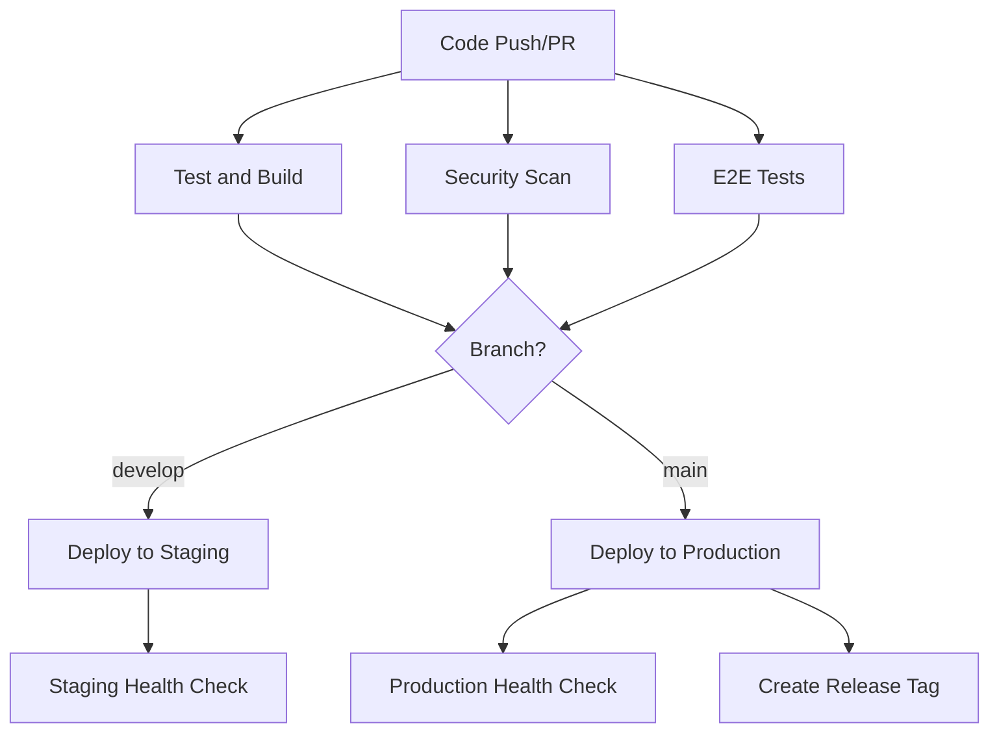

# Frontend CI/CD Pipeline Documentation

## Overview

This document describes the Continuous Integration and Continuous Deployment (CI/CD) pipeline for the URL Redirection Analytics Dashboard frontend application.

## Pipeline Architecture

The CI/CD pipeline is implemented using GitHub Actions and consists of several jobs that run in parallel and sequence to ensure code quality, security, and reliable deployments.

### Pipeline Stages



## Jobs Description

### 1. Test and Build (`test-and-build`)

**Purpose**: Validates code quality and creates production-ready build artifacts.

**Steps**:
- Checkout code
- Setup Node.js environment
- Install dependencies
- Run ESLint for code quality
- Run TypeScript type checking
- Execute unit tests with coverage
- Build production application
- Upload build artifacts

**Triggers**: All pushes and pull requests affecting frontend code

### 2. End-to-End Tests (`e2e-tests`)

**Purpose**: Validates application functionality through browser automation.

**Steps**:
- Download build artifacts
- Start preview server
- Run Cypress E2E tests
- Upload screenshots/videos on failure

**Triggers**: Pull requests and main branch pushes

### 3. Security Scan (`security-scan`)

**Purpose**: Identifies security vulnerabilities and potential secrets.

**Steps**:
- Run npm audit for dependency vulnerabilities
- Scan build files for hardcoded secrets
- Check for common security issues

**Triggers**: All builds

### 4. Deploy to Staging (`deploy-staging`)

**Purpose**: Deploys to staging environment for testing.

**Steps**:
- Configure AWS credentials
- Download build artifacts
- Deploy to staging S3/CloudFront
- Run deployment health checks

**Triggers**: Pushes to `develop` branch
**Environment**: `staging`

### 5. Deploy to Production (`deploy-production`)

**Purpose**: Deploys to production environment.

**Steps**:
- Configure AWS credentials
- Download build artifacts
- Deploy to production S3/CloudFront
- Run comprehensive health checks
- Create deployment tag

**Triggers**: Pushes to `main` branch
**Environment**: `production`

### 6. Rollback (`rollback`)

**Purpose**: Manual rollback capability for emergency situations.

**Triggers**: Manual workflow dispatch
**Environment**: Configurable

## Environment Configuration

### Required Secrets

The following secrets must be configured in GitHub repository settings:

```yaml
AWS_ACCESS_KEY_ID: AWS access key for deployment
AWS_SECRET_ACCESS_KEY: AWS secret key for deployment
```

### Environment Variables

```yaml
NODE_VERSION: '22.x'
AWS_REGION: 'ap-northeast-1'
```

## Branch Strategy

### Main Branch (`main`)
- **Purpose**: Production-ready code
- **Protection**: Requires PR approval and passing checks
- **Deployment**: Automatic deployment to production
- **Tests**: Full test suite including E2E tests

### Develop Branch (`develop`)
- **Purpose**: Integration branch for features
- **Deployment**: Automatic deployment to staging
- **Tests**: Full test suite excluding E2E tests

### Feature Branches
- **Purpose**: Individual feature development
- **Tests**: Unit tests and security scans only
- **Deployment**: None

## Deployment Process

### Staging Deployment

1. **Trigger**: Push to `develop` branch
2. **Build**: Uses production build configuration
3. **Deploy**: Uploads to staging S3 bucket via CloudFront
4. **Verify**: Basic health checks
5. **Notify**: Deployment status

### Production Deployment

1. **Trigger**: Push to `main` branch
2. **Prerequisites**: All tests pass, security scan clean
3. **Build**: Production-optimized build
4. **Deploy**: Blue-green deployment via CloudFront
5. **Verify**: Comprehensive health checks
6. **Tag**: Create deployment tag for rollback reference
7. **Notify**: Deployment status and metrics

## Health Checks

### Basic Health Checks
- Main page accessibility (HTTP 200)
- Health API endpoint (`/health`)
- Static asset loading

### Comprehensive Health Checks
- All basic checks
- Analytics API routing (`/analytics/*`)
- 404 handling for SPA routing
- Content validation (HTML structure)
- Performance metrics

### Health Check Script

```bash
# Run health check manually
./scripts/health-check.sh -e production

# Check staging environment
./scripts/health-check.sh -e staging --retry-count 5
```

## Rollback Procedures

### Automatic Rollback Triggers
- Health check failures after deployment
- Critical errors detected in monitoring

### Manual Rollback

1. **Via GitHub Actions**:
   - Go to Actions tab
   - Select "Frontend CI/CD Pipeline"
   - Click "Run workflow"
   - Select rollback option

2. **Via Script**:
   ```bash
   # List available backups
   ./scripts/rollback-frontend.sh list
   
   # Rollback to specific backup
   ./scripts/rollback-frontend.sh rollback deployments/backups/backup-20250109-120000
   
   # Rollback using S3 versioning
   ./scripts/rollback-frontend.sh version abc123def456
   ```

### Rollback Process

1. **Backup Current**: Create backup of current deployment
2. **Restore Previous**: Upload previous version to S3
3. **Invalidate Cache**: Clear CloudFront cache
4. **Health Check**: Verify rollback success
5. **Notify**: Alert team of rollback completion

## Monitoring and Alerts

### Deployment Metrics
- Build time and success rate
- Test coverage and failure rate
- Deployment frequency and lead time
- Rollback frequency and mean time to recovery

### Alert Conditions
- Build failures
- Test failures
- Security vulnerabilities
- Deployment failures
- Health check failures

## Security Considerations

### Secrets Management
- AWS credentials stored as GitHub secrets
- API keys injected via CloudFront headers
- No secrets in build artifacts

### Security Scanning
- Dependency vulnerability scanning
- Secret detection in code and builds
- Infrastructure security validation

### Access Control
- Branch protection rules
- Required reviews for production deployments
- Environment-specific deployment permissions

## Troubleshooting

### Common Issues

#### Build Failures
```bash
# Check build logs in GitHub Actions
# Run build locally to reproduce
./scripts/build-frontend.sh -e production
```

#### Deployment Failures
```bash
# Check AWS credentials and permissions
aws sts get-caller-identity

# Verify infrastructure exists
aws cloudformation describe-stacks --stack-name FrontendStack
```

#### Health Check Failures
```bash
# Run health check with verbose output
./scripts/health-check.sh -e production --retry-count 1

# Check CloudFront distribution status
aws cloudfront get-distribution --id DISTRIBUTION_ID
```

### Debug Commands

```bash
# Test build process locally
./scripts/pipeline-frontend.sh -e production --dry-run

# Validate deployment without deploying
./scripts/deploy-frontend.sh -e staging --dry-run

# Check infrastructure status
./scripts/health-check.sh -e production
```

## Performance Optimization

### Build Optimization
- Code splitting for faster loading
- Bundle size monitoring
- Asset compression and caching

### Deployment Optimization
- Parallel job execution
- Artifact caching
- Incremental deployments

### Pipeline Optimization
- Skip unnecessary jobs on documentation changes
- Conditional test execution
- Optimized Docker images for faster startup

## Maintenance

### Regular Tasks
- Update Node.js version in pipeline
- Review and update dependencies
- Monitor build performance metrics
- Update security scanning rules

### Quarterly Reviews
- Pipeline performance analysis
- Security audit of deployment process
- Cost optimization review
- Disaster recovery testing

## Support and Documentation

### Additional Resources
- [Build Scripts Documentation](../scripts/README.md)
- [Deployment Guide](./DEPLOYMENT.md)
- [Infrastructure Documentation](./INFRASTRUCTURE.md)

### Getting Help
- Check GitHub Actions logs for detailed error messages
- Review CloudFormation stack events for infrastructure issues
- Use health check scripts for deployment validation
- Contact DevOps team for pipeline issues

---

**Last Updated**: January 2025
**Version**: 1.0
**Maintainer**: DevOps Team